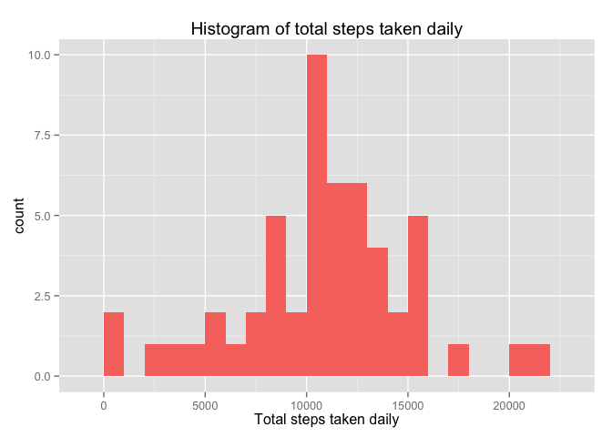
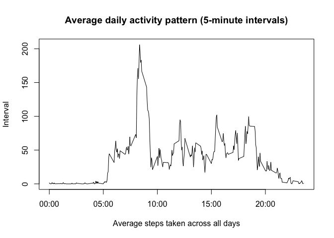
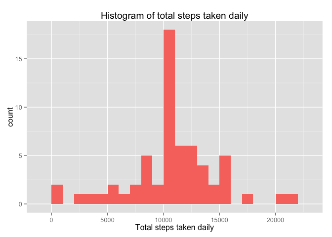
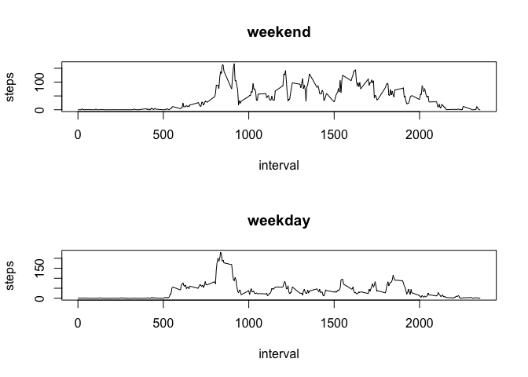

# Reproducible Research: Peer Assessment 1


## Loading and preprocessing the data


```r
# Unzip the archive
unzip(zipfile="activity.zip") 

# Reads data into dataframe "data"
data = read.csv("activity.csv") 
```

## What is mean total number of steps taken per day?


```r
# Load ggplot2 library for plotting
library(ggplot2) 

 # Sum total steps by day for creating histogram
totalsteps = tapply(data$steps, data$date, FUN = sum)

 # Plot histogram of total steps taken daily
qplot(totalsteps, binwidth = 1000, xlab = "Total steps taken daily", fill = "red", main = "Histogram of total steps taken daily") + 
  guides(fill = FALSE)
```

 

```r
# Calculate and report mean for "totalsteps"
mean(totalsteps, na.rm = TRUE) 
```

```
## [1] 10766.19
```

```r
# Calculate and report median for "totalsteps"
median(totalsteps, na.rm = TRUE)
```

```
## [1] 10765
```

## What is the average daily activity pattern?


```r
# Aggregate steps by interval in dataframe "meansteps"
meansteps = aggregate(steps ~ interval, data = data, FUN = mean)

# Rename variables of dataframe "meansteps"
names(meansteps) = c("interval", "steps") 

# Plot the average daily activity pattern 
plot(meansteps$interval, meansteps$steps, type = "l", xlab = "Average steps taken across all days", ylab = "Interval", main = "Average daily activity pattern (5-minute intervals)", xaxt = "n") 
labels = c("00:00", "05:00", "10:00", "15:00", "20:00")
labels.at = seq(0, 2000, 500)
axis(side = 1, at = labels.at, labels = labels)
```

 

```r
#  Return the interval with the maximum number of steps
meansteps[order(meansteps$steps),][288,]$interval
```

```
## [1] 835
```
## Imputing missing values


```r
# Count total number of missing values
sum(is.na(data$steps))
```

```
## [1] 2304
```

```r
# Strategy is to fill in mean of the interval for the missing values
# Create new data frame "filldata" by merging "data" and "meansteps"
filldata = merge(data, meansteps, by = "interval", suffixes = c("", ".m"))

# Find NAs
nas = is.na(filldata$steps)

# Put in means for NAs
filldata$steps[nas] = filldata$steps.m[nas]

# Clean up merged data
filldata = filldata[, c(1:3)]

# Create histogram of filldata - same procedure as above
totalfillsteps = tapply(filldata$steps, filldata$date, FUN = sum)
qplot(totalfillsteps, binwidth = 1000, xlab = "Total steps taken daily", fill = "red", main = "Histogram of total steps taken daily") + 
  guides(fill = FALSE)
```

 

```r
# Calculate and report mean for "totalfillsteps"
mean(totalfillsteps, na.rm = TRUE) 
```

```
## [1] 10766.19
```

```r
# Calculate and report median for "totalfillsteps"
median(totalfillsteps, na.rm = TRUE)
```

```
## [1] 10766.19
```

Values do not really differ from estimates in the first part of the assignment.

The impact of the imputing missing data seems to be low for both mean and median.

## Are there differences in activity patterns between weekdays and weekends?

We will use the "filldata" data frame for this part.


```r
# Create new function, typeofday
typeofday = function(date) {
    if (weekdays(as.Date(date)) %in% c("Saturday", "Sunday")) {
        "weekend"
    } else {
        "weekday"
    }
}

# Make new variable within "filldata" of typeofday
filldata$typeofday <- as.factor(sapply(filldata$date, typeofday))

# Create panel chart
par(mfrow = c(2, 1))
for (type in c("weekend", "weekday")) {
    datatype <- aggregate(steps ~ interval, data = filldata, subset = filldata$typeofday == 
        type, FUN = mean)
    plot(datatype, type = "l", main = type)
}
```

 
